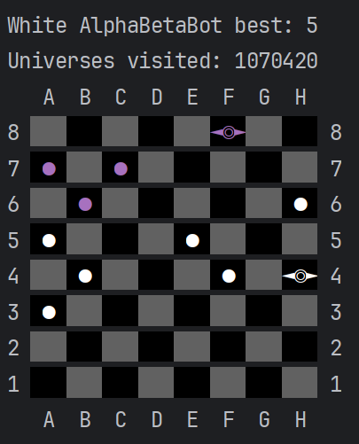
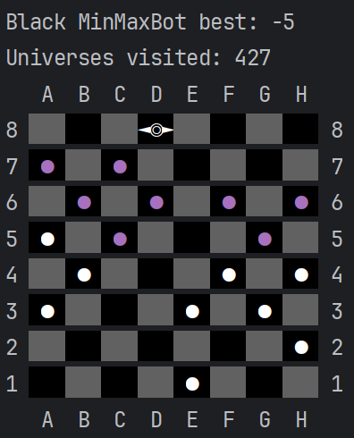

# Checkers AI


Implementation of [minmax](https://en.wikipedia.org/wiki/Minimax) algorithm to play 
classic [checkers](https://en.wikipedia.org/wiki/Checkers). Code written purely in Rust with multithreading\
optimisations and alpha-beta pruning optimization.

## Board representation
```rust
#[derive(Copy, Clone, Debug)]
pub struct Board {
    pub occupation: u32,
    pub color: u32,
    pub figure: u32,
    pub flags: u32,
}
```
Full game state is stored as four 32-bit integers. This allows for easy, almost costless cloning
of the game state.

**Fields:**
- occupation: 0 means no checkers piece, 1 means checkers piece
- color: 0 means white, 1 means black
- figure: 0 means pawn, 1 means queen
- flags: different purposes for example during capturing 1 means that certain piece was laready jumped over.

As an example to get the number of white queens on the board we can use this expression:
```rust
pub fn num_white_queens(&self) -> u32 {
    (&self.occupation & !&self.color & &self.figure).count_ones()
}
```

# Statistics
(better statistics to be added)

### Simple insights
- For now best to play with MinMaxBot depth set to 8 and AlphaBetaBot depth set to 12.
- Comparing MinMaxBot with AlphaBetaBot with depth 8, the first one visits hundred of 
 thousands possible boards whereas the latter only tens of thousands.

## Board estimation strategies
1. CountEstimator - counts the number of pawns and queens advantage over other player (with adjustable weights for pawns and queens)
2. WeightMatrixEstimator - counts the number of pawns and queens advantage where the weight of each is dependant on their position and additional weight parameter.

# Images


